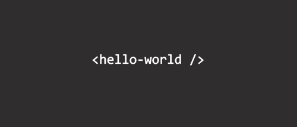

Accompanying the long time standing tradition of using "Hello World" as a testing and teaching tool for coding languages, I'm proud to set down my first "Hello World" for my new personal developer blog. This accompanies the very recent launch of my new portfolio website. As my biography mentions, I'm relatively new to the modern web development world. I've used basic HTML, CSS, and Wordpress over the years in a variety of freelance marketing and social media management roles. I picked up the basics of all three platforms via books, Youtube, and Lynda courses. I found myself always trying to learn more in my free time to try and build very basic brochure websites for myself or friends. The limited capabilities of these small projects eventually made me realize how little I really knew. I wanted to do more. A new adventure was calling my name. 

#The Journey

I decided to start a self-taught journey in 2019 to learn Javascript alongside modern HTML and CSS techniques. I couldn't necessarily afford to enroll for a bootcamp or leave my current full time job. I analyzed several nationwide bootcamp curriculums centered around Javascript to begin learning the several parts that make up the MEAN stack.

I spent several evenings after work going through Udemy courses, Codecademy, Youtube tutorials, podcasts and many documentations. I kept this routine going weekly for the majority of the year. Here are several of my most prized learning resources.

*HTML / CSS*
- Modern HTML & CSS From The Beginning (Including Sass) - Brad Traversy - Udemy
- The Complete 2019 Web Development Bootcamp - Angela Yu - Udemy

*Javascript*
- The Complete Node.js Developer Course (3rd Edition) - Andrew Mean
- Modern Javascript from the Beginning - Brad Traversy
- Angular & NodeJS - The MEAN Stack Guide - Maximilian Schwarzmüller
- JabJabJavascript - Whatsdev
- Beginner Javascript - Wes Bos
- You Don't Know Javascript - Kyle Simpson

*Podcasts*
- Synthax - Wes Bos & Scott Tolinski
- Start Here: Web Development - Dain Miller & Starthere.FM
- Soft Skills Engineering - Jamison Dance & Dave Smith
- Javascript Jabber - DevChat.tv
- DevMode.FM - Andrew Welch, Patrick Harrington
- Script & Style - Todd Gardner & David Walsh

Youtube

- Traversy Media
- Fireship
- Web Dev Simplified
- codigofacilito (Spanish)
- LevelUp Tutorials
- freeCodeCamp.org

Around the summer, I created my first portfolio website [VictorF.tech](http://www.victorf.tech) with Angular compiling a simple "dist" build that I put up on a shared hosting plan. I was happy with it for the longest time before eventually deciding that I wanted to completely redo it.

#GO Time

Shortly after, I began sending out my resume and portfolio out to try and land my first developer role. While interviewing at a few different places, I got the opportunity to learn which tech stacks many agencies are using. While I was interviewing for a Wordpress Developer intern role, I was intrigued to discover that the company was in the process of implementing a more "decoupled approach" for all their client's Wordpress pages. I asked my interviewer several questions trying to understand how this works.

That conversation sparked a fire that lead me to an ongoing personal research and development tract centered around Headless CMS,JAM Stack, GraphQL and GatsbyJS. The time I spent attacking these concepts during the Christmas holidays resulted in the current iteration of VictorDoes.Dev that went live on January 3rd. The blog was implemented a few days after.

I think the blog will serve as a great platform to document my process in becoming a working front end web developer. It will also be a great platform to document some of the challenges I face while learning new material and interviewing. They say you never fully understand a topic until you are able to explain it. I find blogging as a low enough barrier to explain things to others while also hopefully getting outside feedback myself. At the very least, the blog will also improve my writing skills. Simply being able to articulate thoughts and ideas to others can be challenging at times when it involves very complex topics.

That's all I have for this first post. I'll dive into more of the specifics of my Headless CMS learning journey very soon.

Until next time, keep learning.

-Victor

