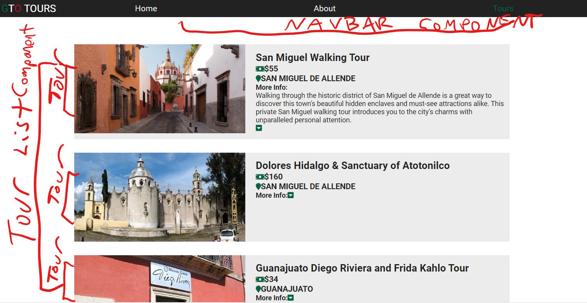

Despite my lack of familiarity with React and GraphQL, my experience building my portfolio project with Gatsby alongside some demo projects has been fantastic. Gatsby truly scales with your expertise and scope. The documentation has been clear enough for me to be able to build some really cool things. There was still more I wanted to do that I did not know how to do. Googling "how to do X in Gatsby" typically ended up in me realizing it should be instead "how to do X in React." I needed a more solid foundation in React.

John Smilga's Gatsby course showed me a great deal of React methodologies and basics from completing three different projects, however there was a lot of things I did not quite understand fully. I knew I had to learn React if I wanted to bring my ideas to life within Gatsby. I ended up purchasing John Smilga's "React Tutorials and Projects Course" and Maximilian Schwarzmüller's "React: The Complete Guide" on Udemy last week. Going back and forth between Max's theory based course modules and John's project build based workflow.

There were several challenges that took me a minute to wrap my heard around in the first few days of learning React. The difference between functional and class based components, as well as when to use each, wasn't very clear to me. Apparently, after React 16.8, both class and functional components are capable of being stateful.

# Functional Component:

```javascript
const FunctionalComponent = () => {
  return <h1> Hello, I'm a functional component!</h1>
}
```

# Class Component

```javascript
import React, { Component } from "react"

class ClassComponent extends Component {
  render() {
    return <div> Hello, I'm a Class Based Component. </div>
  }
}

export default ClassComponent
```

Is it HTML I'm writing within these .JS files? No, it's JSX. The syntax looks like HTML, but it's utimately a tool for extending ECMA script so that HTML-like code can co-exist with Javascript in the same file. It's ultimately getting transpiled into an object that a Javascript engine can parse. Max explained it well by writing an example that shows an inputted JSX with its outputted vanilla Javascript. I pretty much understood it as a shorthand for calling `React.createElement()`.

One thing that really tripped me was commenting code out. React thinks your standard HTML comments are actual DOM nodes.

**_This doesn't work_**

```javascript
<!--  This syntax WILL NOT work -->
```

**_This works_**

```javascript
{
  /* This syntax WILL work */
}
```

A lot of what I learned in Angular did transfer over to some extent, but there were still very major differences. I came to discover that there is no provided routing module for React as there is with Angular. I would list all my paths in a file called "app-routing.module.ts" with each corresponding component inside it. Despite my significant progress this weekend, I've yet to learn about React's third party routing module options.

I'm very eager to dive into routing within React, however there is still much for me to cover on **_state_** and **_destructuring_** that I haven't quite understood yet. During these two days and three nights of non-stop React learning, I was able to whip out this nice little tour website showcasing local tours in my home state of Mexico. Thus far, it only incorporates concepts I've learned in both React classes I'm taking.

I drew out on paper a simple Single Page App which eventualy became this. It has a navigation component up top which shows links to a HOME, ABOUT, and TOURS page. TOURS itself is a component which shows the TOURS LIST component. The TOURS LIST component then displays X amount of TOUR components each with data coming from a pre-created TourData.JS file with a mock data object I created.That data is passed to X amount of TOUR components which then get displayed within the TOURS LIST.

I still need to do more styling of the TOUR component as well as build the HOME and ABOUT components. I'm hoping to work on it more this week. This is all very much a **work in progress**. I hope to keep going with this project while learning more React. Until next time!

**WIP**
[Github](https://github.com/v-flores/guanajuatotours)

